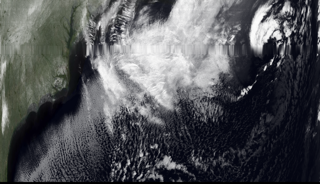

# Azimuth — Decentralized Satellite Ground Station Network

> **DePIN satellite ground stations that turn real-world physical work into on-chain credit history on Solana.**

A network of DePIN ground stations collaboratively receive satellite image transmissions, submit cryptographic proofs on **Solana**, and earn **AZM token** rewards — with every verified reception permanently anchored on Arweave. Operators build a verifiable on-chain financial identity from their uptime and reception quality.



**Demo:** https://youtu.be/sN1ynR5zsPQ

---

## Table of Contents

- [How It Works](#how-it-works)
- [Architecture](#architecture)
- [Program Accounts](#program-accounts)
- [Project Structure](#project-structure)
- [Prerequisites](#prerequisites)
- [End-to-End Setup](#end-to-end-setup)
  - [1. Toolchain](#1-toolchain)
  - [2. Build the Anchor Program](#2-build-the-anchor-program)
  - [3. Deploy to Devnet](#3-deploy-to-devnet)
  - [4. Create AZM Token](#4-create-azm-token)
  - [5. Initialize the Vault](#5-initialize-the-vault)
  - [6. Register a Station](#6-register-a-station)
  - [7. Run solana-client on the Pi](#7-run-solana-client-on-the-pi)
  - [8. Run the Dashboards](#8-run-the-dashboards)
  - [9. Run the Ground Station (Python)](#9-run-the-ground-station-python)
  - [10. Run the Transmitter](#10-run-the-transmitter)
- [Multi-Station Coordination](#multi-station-coordination)
- [Demo Flow](#demo-flow)
- [Hardware](#hardware)

---

## How It Works

1. **Transmit** — A Heltec ESP32 LoRa module (simulating a satellite) broadcasts a JPEG image as 104 numbered packets at 915 MHz
2. **Receive** — Ground stations capture packets via Heltec LoRa receivers connected over USB
3. **Reconstruct** — Each station's Python dashboard assembles the image from received packets in real time
4. **Prove** — `solana-client` automatically:
   - Sends **PoA heartbeats** every 60s via the `heartbeat` Anchor instruction
   - Submits **PoRx proofs** (Merkle root of packet hashes) after each satellite pass
   - Uploads raw packet bytes to **Arweave** via Irys
5. **Coordinate** — The primary station polls Arweave/Irys GraphQL for peer packet announcements, fetches both datasets, merges packets into the best possible image, uploads to Arweave, and calls `recordImage()` on-chain
6. **Settle** — A **keeper bot** (running on the Pi alongside the client) polls the on-chain epoch state and triggers `settlePoaEpoch` when the interval elapses, distributing AZM rewards to all qualifying stations via `remaining_accounts`
7. **Earn** — AZM rewards land directly in each station's token account

---

## Architecture

```
┌────────────────────┐   LoRa 915 MHz   ┌──────────────────────┐
│  Heltec ESP32      │ ───────────────▶ │  Heltec ESP32         │
│  (Satellite Sim)   │                  │  (LoRa-to-USB Bridge) │
│  Broadcasts JPEG   │                  └─────────┬────────────┘
│  104 LoRa packets  │                            USB Serial
└────────────────────┘         ┌─────────────────┴────────────┐
                                │  Ground Station (Pi / Mac)    │
                                │  azimuth_station.py (Pygame)  │
                                │  solana-client/index.js       │
                                │    ├─ heartbeat.js            │
                                │    ├─ proofSubmitter.js       │
                                │    ├─ packetPublisher.js      │
                                │    ├─ imageMerger.js          │
                                │    ├─ keeper.js               │
                                │    └─ statePoller.js          │
                                └─────────────────┬────────────┘
                                                  │
                               ┌──────────────────┴───────────────────┐
                               │            Solana Devnet              │
                               │                                        │
                               │   ┌────────────────────────────┐    │
                               │   │     OrbitalVault (Anchor)   │    │
                               │   │  PDA: ["vault_config"]       │    │
                               │   │  • heartbeat()               │    │
                               │   │  • submitPorx()              │    │
                               │   │  • claimPorxReward()         │    │
                               │   │  • verifyPorx()              │    │
                               │   │  • executePorxPayout()       │    │
                               │   │  • settlePoaEpoch()          │    │
                               │   │  • recordImage()             │    │
                               │   │  • registerStation()         │    │
                               │   │  • requestUnstake()          │    │
                               │   │  • executeUnstake()          │    │
                               │   └────────────────────────────┘    │
                               │                                        │
                               │   ┌────────────────────────────┐    │
                               │   │   AZM SPL Token             │    │
                               │   │   Mint: set at init          │    │
                               │   │   Held in vault ATA          │    │
                               │   └────────────────────────────┘    │
                               └──────────────────────────────────────┘
                                                  │
                                      Arweave (Irys devnet)
                                   Permanent packet + image archive
                                   Queried via Irys GraphQL
```

---

## Program Accounts

| Account | Seeds | Description |
|---|---|---|
| `VaultConfig` | `["vault_config"]` | Global config — epoch state, reward rates, station list |
| `Station` | `["station", station_pubkey]` | Per-station state — heartbeat count, rewards, active status |
| `PoRxProof` | `["porx", pass_id, station_pubkey]` | Per-pass proof — packet count, Merkle root, RSSI/SNR, reward |
| `ImageRecord` | `["image", pass_id]` | Merged image record — Arweave TX ID, recovery stats |

---

## Project Structure

```
azimuth-solana/
├── programs/orbital_vault/        # Anchor program (Rust)
│   └── src/
│       ├── lib.rs                 # Instruction dispatchers
│       ├── state.rs               # Account structs + events
│       ├── errors.rs              # AzimuthError enum
│       └── instructions/
│           ├── initialize.rs
│           ├── register_station.rs
│           ├── heartbeat.rs
│           ├── settle_poa_epoch.rs
│           ├── submit_porx.rs
│           ├── claim_porx_reward.rs
│           ├── verify_porx.rs
│           ├── execute_porx_payout.rs
│           ├── request_unstake.rs
│           ├── cancel_unstake.rs
│           ├── execute_unstake.rs
│           ├── slash.rs
│           ├── record_image.rs
│           └── admin.rs
├── tests/
│   └── orbital_vault.ts           # Anchor TypeScript tests
├── scripts/
│   ├── createToken.ts             # Create AZM SPL mint + fund vault
│   ├── initializeVault.ts         # Initialize OrbitalVault PDA
│   └── registerStation.ts        # Register a station on-chain
├── solana-client/                 # Node.js client (runs on Pi)
│   ├── index.js                   # Orchestrator — starts all loops
│   ├── config.js                  # Connection, keypair, PDAs, IDL
│   ├── heartbeat.js               # PoA heartbeat loop (every 60s)
│   ├── proofSubmitter.js          # PoRx submit + claim + peer verify
│   ├── packetPublisher.js         # Arweave upload via Irys
│   ├── imageMerger.js             # Irys GraphQL → merge → recordImage
│   ├── keeper.js                  # Epoch settle + PoRx payout + unstake
│   ├── statePoller.js             # Poll on-chain state for Pygame UI
│   ├── stateWriter.js             # Write solana_state.json for Python
│   ├── package.json
│   └── .env.example
├── ground_station/
│   └── azimuth_station.py         # Python Pygame ground station UI
├── dashboard/                     # Next.js station dashboard
│   ├── app/page.js
│   ├── lib/
│   │   ├── program.js             # Anchor read-only client
│   │   ├── useStationData.js      # React hook — polls on-chain state
│   │   └── utils.js
│   └── components/
│       ├── Header.js
│       ├── PoaMonitor.js
│       ├── PorxFeed.js
│       └── StationStatus.js
├── image-dashboard/               # Next.js satellite image archive
│   ├── app/page.js
│   └── lib/arweave.js             # Irys GraphQL queries
├── azimuth_transmitter/           # ESP32 satellite simulator firmware
├── azimuth_receiver/              # ESP32 LoRa-to-USB bridge firmware
├── Anchor.toml
├── Cargo.toml
├── package.json
└── tsconfig.json
```

---

## Prerequisites

| Tool | Version | Install |
|---|---|---|
| Rust | stable | `curl --proto '=https' --tlsv1.2 -sSf https://sh.rustup.rs \| sh` |
| Solana CLI | ≥ 1.18 | [docs.solana.com/cli/install](https://docs.solana.com/cli/install-solana-cli-tools) |
| Anchor CLI | 0.31.0 | `cargo install --git https://github.com/coral-xyz/anchor avm --locked && avm install 0.31.0 && avm use 0.31.0` |
| Node.js | ≥ 18 | [nodejs.org](https://nodejs.org) |
| Yarn | any | `npm install -g yarn` |
| Python | ≥ 3.9 | system or [python.org](https://python.org) |

---

## End-to-End Setup

### 1. Toolchain

```bash
# Verify installations
rustc --version          # rustc 1.x.x
solana --version         # solana-cli 1.18.x
anchor --version         # anchor-cli 0.31.0
node --version           # v18.x.x or later

# Set Solana to devnet
solana config set --url devnet

# Create a keypair if you don't have one
solana-keygen new --outfile ~/.config/solana/id.json

# Airdrop devnet SOL (repeat if needed)
solana airdrop 2
```

---

### 2. Build the Anchor Program

```bash
# From project root
yarn install
anchor build
```

Expected output: `Finished release [optimized] target(s)`

The IDL is generated at `target/idl/orbital_vault.json` — all TypeScript clients load it from there.

---

### 3. Deploy to Devnet

```bash
anchor deploy
```

Copy the **Program ID** printed by `anchor deploy` (e.g. `8aor5jUiu4irhm6MKjWSXTPq8JECXwZY4oJjRxSAuGPr`).

Update two places with the real program ID:

**`Anchor.toml`** — `[programs.devnet]` section:
```toml
[programs.devnet]
orbital_vault = "YOUR_PROGRAM_ID"
```

**`programs/orbital_vault/src/lib.rs`** — `declare_id!`:
```rust
declare_id!("YOUR_PROGRAM_ID");
```

Then rebuild and redeploy:
```bash
anchor build && anchor deploy
```

---

### 4. Create AZM Token

```bash
# Set env var for the script
export ORBITAL_VAULT_PROGRAM_ID=YOUR_PROGRAM_ID
export ANCHOR_PROVIDER_URL=https://api.devnet.solana.com
export ANCHOR_WALLET=~/.config/solana/id.json

ts-node scripts/createToken.ts
```

This creates the AZM SPL mint, creates the vault ATA (associated token account owned by the `vault_config` PDA), mints 1,000,000 AZM into it, and saves the addresses to `scripts/.token.json`.

---

### 5. Initialize the Vault

```bash
ts-node scripts/initializeVault.ts
```

This calls `initialize()` on-chain with:
- 6-hour PoA epoch interval
- 2 AZM PoA reward per epoch per station
- 1 AZM per received packet (PoRx base reward)
- 100 AZM stake requirement
- 7-day unstake cooldown
- Minimum 1 heartbeat per epoch threshold

---

### 6. Register a Station

```bash
export STATION_PUBKEY=<station wallet pubkey>
export STATION_LOCATION="Station A — Austin, TX"
ts-node scripts/registerStation.ts
```

Repeat for each station with its own keypair. The admin wallet (authority) registers stations; each station uses its own keypair for heartbeats and proofs.

---

### 7. Run solana-client on the Pi

#### Configure environment

```bash
cd solana-client
cp .env.example .env
```

Edit `.env`:
```
SOLANA_RPC_URL=https://api.devnet.solana.com
ORBITAL_VAULT_PROGRAM_ID=YOUR_PROGRAM_ID
OPERATOR_KEYPAIR_PATH=~/.config/solana/id.json
AZM_MINT=<mint pubkey from scripts/.token.json>
HEARTBEAT_INTERVAL_MS=60000
SCHEDULE_POLL_INTERVAL_MS=30000
STATE_FILE=../ground_station/solana_state.json
IS_PRIMARY=true           # set false on secondary stations
IRYS_NODE=https://devnet.irys.xyz
```

#### Install and start

```bash
npm install
node index.js
```

The client starts all loops simultaneously:
- **Heartbeat loop** — sends `heartbeat()` every 60s
- **Proof watcher** — monitors `../ground_station/reception_event.json` for new passes, submits PoRx proof + claim
- **Peer verifier** — scans all on-chain proofs and cross-verifies peers for the same pass
- **Image merger** (primary only) — polls Irys GraphQL for packet announcements, merges datasets, uploads combined JPEG to Arweave, calls `recordImage()`
- **Keeper bot** — checks every 30s:
  - Is the PoA epoch interval elapsed? → calls `settlePoaEpoch()` with all station ATAs in `remaining_accounts`
  - Are there any claimed+verified+unpaid PoRx proofs? → calls `executePorxPayout()`
  - Are there any stations past their unstake cooldown? → calls `executeUnstake()`
- **State poller** — polls on-chain accounts every 30s and writes `solana_state.json` for the Pygame dashboard

#### Running multiple stations

On each additional Pi, set `IS_PRIMARY=false` in `.env` (disables the image merger — only one station merges). All other loops run identically.

---

### 8. Run the Dashboards

#### Ground Station Dashboard

```bash
cd dashboard
npm install @solana/web3.js @coral-xyz/anchor @solana/spl-token
npm install
```

Create `dashboard/.env.local`:
```
NEXT_PUBLIC_RPC_URL=https://api.devnet.solana.com
NEXT_PUBLIC_PROGRAM_ID=YOUR_PROGRAM_ID
NEXT_PUBLIC_AZM_MINT=YOUR_AZM_MINT
```

```bash
npm run dev
# Open http://localhost:3000
# Enter a station's Solana pubkey in the address bar
```

#### Image Archive Dashboard

```bash
cd image-dashboard
npm install
```

Create `image-dashboard/.env.local`:
```
NEXT_PUBLIC_IRYS_GRAPHQL=https://devnet.irys.xyz/graphql
NEXT_PUBLIC_IRYS_GATEWAY=https://devnet.irys.xyz
```

```bash
npm run dev
# Open http://localhost:3001
```

---

### 9. Run the Ground Station (Python)

```bash
cd ground_station
pip install pygame pyserial pillow

# With Pygame UI (connected LoRa receiver on USB)
python azimuth_station.py

# Specify USB port
python azimuth_station.py /dev/ttyACM0

# Headless (no display — Raspberry Pi without monitor)
python azimuth_station.py --no-ui
```

When a satellite pass is received, the script writes `reception_event.json` to the `ground_station/` directory. `solana-client/proofSubmitter.js` watches for this file and automatically submits the PoRx proof on-chain.

The Pygame UI reads `solana_state.json` (written by `stateWriter.js`) and shows the live Solana status panel: heartbeat count, PoA epoch, next settlement countdown, earned AZM.

**Controls:**
- `R` — Reset and wait for a new image
- `ESC` / `Q` — Quit

---

### 10. Run the Transmitter

Flash `azimuth_transmitter/` to a Heltec WiFi LoRa 32 V4 board. It broadcasts a JPEG image as 104 numbered packets at 915 MHz on a loop.

Flash `azimuth_receiver/` to a second Heltec board connected via USB. It bridges LoRa packets to the serial port that `azimuth_station.py` reads.

---

## Multi-Station Coordination

Two ground stations collaborate to produce a higher-quality combined image — with **Arweave/Irys** as the coordination layer. No direct contact between nodes ever occurs.

```
Station A                     Arweave (Irys)                Station B
    │                             │                              │
    │── upload packets ──────────▶│                             │
    │   tags: App-Name=azimuth    │◀── upload packets ──────────│
    │         Data-Type=packets   │    tags: App-Name=azimuth   │
    │         passId=0xABCD...    │          Data-Type=packets  │
    │         station=PubkeyA     │          passId=0xABCD...   │
    │                             │          station=PubkeyB    │
    │                             │                              │
    │◀── Irys GraphQL poll ───────│                             │
    │    sees 2 entries for passId│                              │
    │                             │                              │
    │── fetches both TX data ────▶│                             │
    │── merges packets            │                              │
    │── uploads merged JPEG ─────▶│                             │
    │── recordImage() ───────────▶ OrbitalVault (on-chain)      │
```

| Layer | Role |
|---|---|
| **Arweave/Irys** | Coordination + storage — packet announcements tagged with `passId` and `station`, queried via GraphQL |
| **OrbitalVault** | Records the merged image on-chain with Arweave TX ID, recovered count, and total packets |

---

## Demo Flow

```
1. Station A + Station B registered on-chain — 100 AZM staked each

2. Satellite transmits 104 LoRa packets → Station A captures 72/104,
   Station B captures 81/104

3. Both stations reconstruct partial images on their Pygame dashboards

4. Each station uploads packets to Arweave via Irys with tags:
   → Station A: App-Name=azimuth, Data-Type=packets, passId=0xABCD..., packetCount=72
   → Station B: App-Name=azimuth, Data-Type=packets, passId=0xABCD..., packetCount=81

5. Primary station (Station A) polls Irys GraphQL, detects both uploads
   for the same passId:
   → Fetches both datasets from Arweave gateway
   → Merges packets: 72 + 81 = 96 unique packets recovered
   → Reconstructs combined image, uploads to Arweave
   → Calls recordImage(passId, arweaveTxId, 96, 104) on OrbitalVault

6. PoRx proofs submitted:
   → Merkle root of packet hashes computed and submitted via submitPorx()
   → Each station calls claimPorxReward() then peer calls verifyPorx()
   → Keeper bot calls executePorxPayout() → AZM transferred to station ATA

7. PoA epoch interval elapses → keeper bot calls settlePoaEpoch():
   → Passes all qualifying station PDAs + ATAs in remaining_accounts
   → Each station that met the heartbeat threshold receives poa_reward_amount AZM
   → epoch_count incremented, epoch_start reset

8. Image archive dashboard shows merged image with completeness badge
   → Permanent Arweave link, pass metadata, contributing stations
```

---

## Hardware

| Component | Role | Cost |
|---|---|---|
| Heltec WiFi LoRa 32 V4 | Satellite simulator (transmitter) | ~$25 |
| Heltec WiFi LoRa 32 V4 | LoRa-to-USB receiver bridge | ~$25 |
| Raspberry Pi 5 | Ground station compute | ~$60 |

Each ground station costs under $100. Azimuth makes this hardware economically productive by connecting it to Solana's financial infrastructure — turning a $20 LoRa radio into a revenue-generating node with a permanent on-chain proof history.
